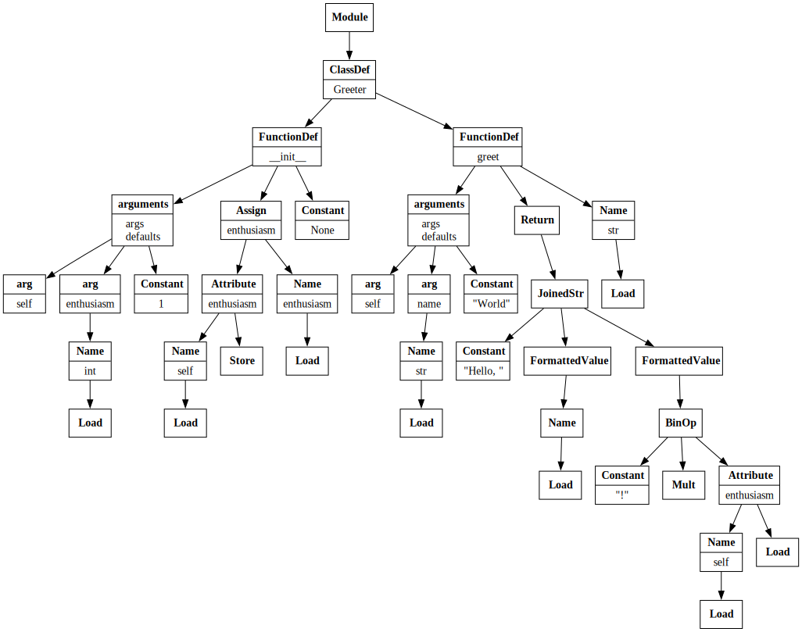
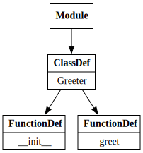
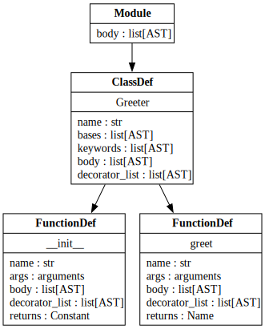
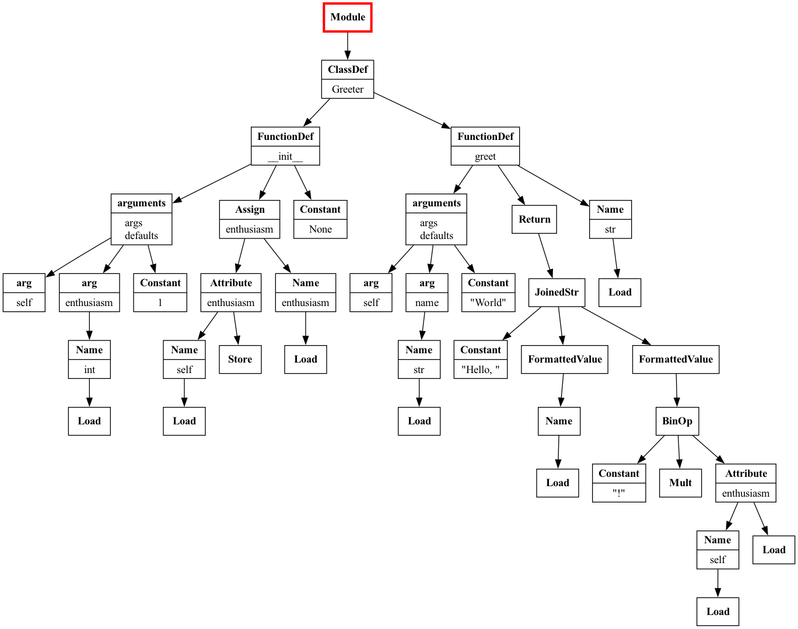
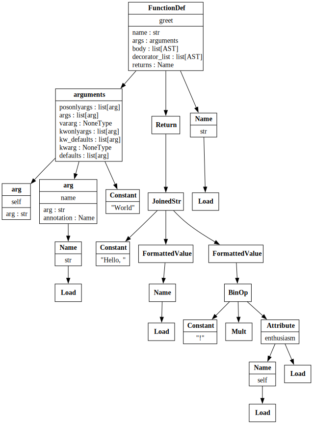

[id=bio]
## Bio

- 👩🏻‍💻 Software engineer at Bloomberg in NYC
- ✨ Core developer of [numpydoc](https://github.com/numpy/numpydoc) and creator of [numpydoc's pre-commit hook](https://numpydoc.readthedocs.io/en/latest/validation.html#docstring-validation-using-pre-commit-hook), which uses static code analysis
- ✍ Author of "[Hands-On Data Analysis with Pandas](https://stefaniemolin.com/books/Hands-On-Data-Analysis-with-Pandas-2nd-edition/)"
- 🎓 Bachelor's degree in operations research from Columbia University
- 🎓 Master's degree in computer science from Georgia Tech

[notes]
This is a highly-technical keynote, but don't worry about getting lost or trying to take pictures of the code as its up on the screen because the slides are self-contained, and I have made them publicly-available on my website.

---

## What makes a tool a static code analyzer?

<p class="fragment">It analyzes source code <b>without</b> running it.</p>

---

### What are the main benefits of static code analysis?

<ul>
  <li class="fragment fade-in">
    Speed &ndash; can be <em>much</em> faster than dynamic code analysis
  </li>
  <li class="fragment fade-in">
    Portable &ndash; no need to install the codebase being analyzed or its dependencies
  </li>
</ul>

---

### How do you build a static code analyzer?

<p class="fragment fade-in-then-semi-out">It depends...</p>

<p class="fragment fade-in"><strong>Abstract Syntax Trees (ASTs)</strong> are a good place to start.</p>

---

## Abstract Syntax Tree (AST)

<ul>
  <li class="fragment fade-in">
    Represents the structure of the source code as a tree
  </li>
  <li class="fragment fade-in">
    Nodes in the tree are language constructs (<em>e.g.</em>, module, class, function)
  </li>
  <li class="fragment fade-in">
    Each node has a single parent (<em>e.g.</em>, a class is a child of a single module)
  </li>
  <li class="fragment fade-in">
    Parent nodes can have multiple children (<em>e.g.</em>, a class can have several methods)
  </li>
</ul>

---

[data-transition=slide-in fade-out]

Let's see what this code snippet (`greet.py`) looks like when represented as an AST:

```python
class Greeter:
    def __init__(self, enthusiasm: int = 1) -> None:
        self.enthusiasm = enthusiasm

    def greet(self, name: str = 'World') -> str:
        return f'Hello, {name}{"!" * self.enthusiasm}'
```

---

[data-transition=slide-out fade-in]
<div class="center">
  
  <br/>
  <small>The AST for <code>greet.py</code> visualized with Graphviz.</small>
</div>

---

## ASTs in Python

<ul>
  <li class="fragment fade-in">
    Represent syntactically-correct Python code (cannot be generated in the presence of syntax errors)
  </li>
  <li class="fragment fade-in">
    Created by the parser as an intermediary step when
    <a href="https://github.com/python/cpython/blob/main/InternalDocs/compiler.md">
      compiling source code into byte code
    </a> (necessary to run it)
  </li>
  <li class="fragment fade-in">
    Available in the standard library via the <code>ast</code> module
  </li>
</ul>

---

### Parsing Python source code into an AST

---

#### 1. Read in the source code

```pycon
>>> from pathlib import Path
>>> source_code = Path('greet.py').read_text()
```

---

#### 2. Parse it with the `ast` module

If the code is syntactically-correct, we get an AST back:

```
>>> import ast
>>> tree = ast.parse(source_code)
>>> print(type(tree))
&lt;class 'ast.Module'>
```

---

### Inspecting the AST

<div class="r-stack r-stack-left">
  <p class="fragment fade-out" data-fragment-index="0">
    Use <code>ast.dump()</code> to display the AST:
  </p>
  <p class="fragment fade-in-then-out" data-fragment-index="0">
    The root node is an <code>ast.Module</code> node:
  </p>
  <p class="fragment fade-in-then-out" data-fragment-index="1">
    It contains everything else in its <code>body</code> attribute:
  </p>
  <p class="fragment fade-in-then-out" data-fragment-index="2">
    The <code>greet.py</code> file first defines a class, named <code>Greeter</code>:
  </p>
  <p class="fragment fade-in-then-out" data-fragment-index="3">
    The <code>ast.ClassDef</code> node also contains the <code>body</code> of the <code>Greeter</code> class:
  </p>
  <p class="fragment fade-in-then-out" data-fragment-index="4">
    The first entry is the <code>Greeter.__init__()</code> method:
  </p>
  <p class="fragment fade-in-then-out" data-fragment-index="5">
    The <code>ast.FunctionDef</code> node includes information about the arguments:
  </p>
  <p class="fragment fade-in-then-out" data-fragment-index="6">
    Its <code>body</code> contains the AST representation of the function's code:
  </p>
  <p class="fragment fade-in-then-out" data-fragment-index="7">
    The return annotation is stored in the <code>returns</code> attribute:
  </p>
  <p class="fragment fade-in-then-out" data-fragment-index="8">
    The final entry is the <code>Greeter.greet()</code> method:
  </p>
</div>

<pre>
    <code data-trim class="language-pycon hide-line-numbers" data-line-numbers="1|2|3-51|4-5|6-53|7-8|9-16|17-24|25|26-53" data-fragment-index="0">
>>> print(ast.dump(tree, indent=2))
Module(
  body=[
    ClassDef(
      name='Greeter',
      body=[
        FunctionDef(
          name='__init__',
          args=arguments(
            args=[
              arg(arg='self'),
              arg(
                arg='enthusiasm',
                annotation=Name(id='int', ctx=Load()))],
            defaults=[
              Constant(value=1)]),
          body=[
            Assign(
              targets=[
                Attribute(
                  value=Name(id='self', ctx=Load()),
                  attr='enthusiasm',
                  ctx=Store())],
              value=Name(id='enthusiasm', ctx=Load()))],
          returns=Constant(value=None)),
        FunctionDef(
          name='greet',
          args=arguments(
            args=[
              arg(arg='self'),
              arg(
                arg='name',
                annotation=Name(id='str', ctx=Load()))],
            defaults=[
              Constant(value='World')]),
          body=[
            Return(
              value=JoinedStr(
                values=[
                  Constant(value='Hello, '),
                  FormattedValue(
                    value=Name(id='name', ctx=Load()),
                    conversion=-1),
                  FormattedValue(
                    value=BinOp(
                      left=Constant(value='!'),
                      op=Mult(),
                      right=Attribute(
                        value=Name(id='self', ctx=Load()),
                        attr='enthusiasm',
                        ctx=Load())),
                    conversion=-1)]))],
          returns=Name(id='str', ctx=Load()))])])
</code>
</pre>

---

### Popular open source tools that use ASTs

<ul>
  <li class="fragment fade-in">
    Linters and formatters, like <code>ruff</code> (Rust) and <code>black</code> (Python)
  </li>
  <li class="fragment fade-in">
    Documentation tools, like <code>sphinx</code> and the <code>numpydoc-validation</code> pre-commit hook
  </li>
  <li class="fragment fade-in">
    Automatic Python syntax upgrade tools, like <code>pyupgrade</code>
  </li>
  <li class="fragment fade-in">
    Type checkers, like <code>mypy</code>
  </li>
  <li class="fragment fade-in">
    Code security tools, like <code>bandit</code>
  </li>
  <li class="fragment fade-in">
    Code and testing coverage tools, like <code>vulture</code> and <code>coverage.py</code>
  </li>
  <li class="fragment fade-in">
    Testing frameworks that instrument your code or generate tests based on it, like <code>hypothesis</code> and <code>pytest</code>
  </li>
</ul>

---

## Let's build a simple static code analyzer

<p class="fragment">
  To learn how to use the AST, we will build a tool that does the following:
</p>

<ul>
  <li class="fragment fade-in">
    Finds missing docstrings and suggests templates based on the code itself
  </li>
  <li class="fragment fade-in">
    Uses only the Python standard library
  </li>
</ul>

<p class="fragment">
  <em>Tools may exist that do this already, but the point is to learn how to use the AST.</em>
</p>

---

### The input

We will analyze a single file, `greet.py`, for time and space considerations:

```python
class Greeter:
    def __init__(self, enthusiasm: int = 1) -> None:
        self.enthusiasm = enthusiasm

    def greet(self, name: str = 'World') -> str:
        return f'Hello, {name}{"!" * self.enthusiasm}'
```

---

### Is static code analysis really necessary here?

<p class="fragment" data-fragment-index="0">
  While we are working with one file here, most codebases will be much larger. How could we approach this scalably?
</p>

<ol>
  <li class="fragment fade-in" data-fragment-index="1">
    <span class="fragment strike" data-fragment-index="2">Manually (open each file and edit)</span>
    <span class="fragment fade-in" data-fragment-index="2">&ndash; tedious and error prone</span>
  </li>
  <li class="fragment fade-in" data-fragment-index="3">
    <span class="fragment strike" data-fragment-index="4">Regular expressions</span>
    <span class="fragment fade-in" data-fragment-index="4">&ndash; messy and hard to get right (edge cases, context, <em>etc.</em>)</span>
  </li>
  <li class="fragment fade-in" data-fragment-index="5">
    <span class="fragment strike" data-fragment-index="6">Script to import everything and check docstrings</span>
    <span class="fragment fade-in" data-fragment-index="6">&ndash; must be able to install codebase and its dependencies; slow</span>
  </li>
  <li class="fragment fade-in" data-fragment-index="7">
    <span>Static code analysis</span>
    <span class="fragment fade-in" data-fragment-index="8">&ndash; analyzing code without executing it means we can use this on any of our codebases</span>
    <span class="fragment fade-in" data-fragment-index="9">✅</span>
  </li>
</ol>

---

## Important disclaimer before we dive in

<p class="fragment">
  Docstrings have been omitted from all code snippets for space 😂
</p>

<p class="fragment">
  <b>Fear not</b> &ndash; we are building a tool to fix that!
</p>

---

## Detecting missing docstrings using the Python AST

<div class="r-stack r-stack-left">
  <p class="fragment fade-in-then-out" data-fragment-index="0">
    We need to traverse the full AST (to account for nested functions and classes) and inspect each node's docstring:
  </p>
  <p class="fragment fade-in-then-out" data-fragment-index="1">
    Only <code>ast.Module</code>, <code>ast.ClassDef</code>, <code>ast.FunctionDef</code>, and <code>ast.AsyncFunctionDef</code> nodes can have docstrings:
  </p>
  <p class="fragment fade-in-then-out" data-fragment-index="2">
    If there is one, <code>ast.get_docstring(node)</code> returns the docstring of <code>node</code>; otherwise, it returns <code>None</code>:
  </p>
</div>

<div class="fragment" data-fragment-index="0">
<pre>
    <code data-trim class="language-python hide-line-numbers" data-line-numbers="1-9|2-5|7" data-fragment-index="1">
def detect_missing_docstring(
    node: ast.AsyncFunctionDef
    | ast.ClassDef
    | ast.FunctionDef
    | ast.Module
) -> None:
    if ast.get_docstring(node) is None:
        entity = getattr(node, 'name', 'module')
        print(f'{entity} is missing a docstring')
    </code>
</pre>
</div>

---

In `greet.py`, we want to call this function on these nodes only:

<div class="center">
  
</div>

---

## Traversing the AST

<p class="fragment">
  File structures vary, so we will create a <code>NodeVisitor</code> to ensure we find all missing docstrings:
</p>

<ol>
  <li class="fragment">Subclass <code>ast.NodeVisitor</code></li>
  <li class="fragment">Create <code>visit_&lt;NodeType&gt;()</code> methods for nodes we are interested in</li>
  <li class="fragment">Instantiate the visitor and call its <code>visit()</code> method</li>
</ol>

---

### 1. Subclass `ast.NodeVisitor`

```python
class DocstringVisitor(ast.NodeVisitor):
    pass
```

---

### 2. Create `visit_<NodeType>()` methods for nodes we are interested in

```python [highlight-lines="3-15"][class="hide-line-numbers"]
class DocstringVisitor(ast.NodeVisitor):

    def visit_AsyncFunctionDef(
        self, node: ast.AsyncFunctionDef
    ) -> None:
        detect_missing_docstring(node)

    def visit_FunctionDef(self, node: ast.FunctionDef) -> None:
        detect_missing_docstring(node)

    def visit_ClassDef(self, node: ast.ClassDef) -> None:
        detect_missing_docstring(node)

    def visit_Module(self, node: ast.Module) -> None:
        detect_missing_docstring(node)
```

---

### 3. Instantiate the visitor and call its `visit()` method

```pycon [highlight-lines="1-2|3"][class="hide-line-numbers"]
>>> visitor = DocstringVisitor()
>>> visitor.visit(tree)
module is missing a docstring
```

<p class="fragment">What about the missing docstrings for the <code>Greeter</code> class and its methods?</p>

---

### Complete traversal means visiting all fields

We aren't visiting the list of AST nodes in the `ast.Module` node's `body` field, so traversal starts and stops there:

<div class="center">
  
</div>

---

### The `general_visit()` method

<ul>
  <li class="fragment">Defined on base class <code>ast.NodeVisitor</code></li>
  <li class="fragment">Visits child nodes by calling <code>visit()</code> on any nodes returned from <code>ast.iter_fields()</code></li>
  <li class="fragment">Called automatically for node types for which we didn't create methods</li>
</ul>


---

### Modifying the `DocstringVisitor`

<div class="r-stack r-stack-left">
  <p class="fragment fade-in-then-out" data-fragment-index="0">
    We add the <code>_visit_helper()</code> method, which checks the docstring and then continues the traversal:
  </p>
  <p class="fragment fade-in-then-out" data-fragment-index="1">
    Calling <code>generic_visit()</code> on each node for which we check docstrings for ensures we continue the traversal:
  </p>
  <p class="fragment fade-in-then-out" data-fragment-index="2">
    Now, we switch to calling <code>_visit_helper()</code> whenever we visit module, class, or function nodes:
  </p>
</div>

<div class="fragment" data-fragment-index="0">
<pre>
    <code data-trim class="language-python hide-line-numbers" data-line-numbers="3-11|11|13-25" data-fragment-index="1">
class DocstringVisitor(ast.NodeVisitor):

    def _visit_helper(
        self,
        node: ast.AsyncFunctionDef
        | ast.ClassDef
        | ast.FunctionDef
        | ast.Module
    ) -> None:
        detect_missing_docstring(node)
        self.generic_visit(node)

    def visit_AsyncFunctionDef(
        self, node: ast.AsyncFunctionDef
    ) -> None:
        self._visit_helper(node)

    def visit_FunctionDef(self, node: ast.FunctionDef) -> None:
        self._visit_helper(node)

    def visit_ClassDef(self, node: ast.ClassDef) -> None:
        self._visit_helper(node)

    def visit_Module(self, node: ast.Module) -> None:
        self._visit_helper(node)
</code>
</pre>
</div>


---

### Complete traversal achieved 🎉

```pycon [highlight-lines="3-6"][class="hide-line-numbers"]
>>> visitor = DocstringVisitor()
>>> visitor.visit(tree)
module is missing a docstring
Greeter is missing a docstring
__init__ is missing a docstring
greet is missing a docstring
```

---

<div class="center">
  <video width="80%" controls>
    <source src="./media/traversal-animation.mp4" type="video/mp4">
    Your browser does not support the video tag.
  </video>
  <!--  -->
</div>

---

## Disambiguating docstring paths

`greet` could be the `greet()` method or the `greet` module, but `greet.Greeter.greet` can only be one:

```plaintext
greet is missing a docstring
```

---

### Tracking node ancestry with a stack

<div class="r-stack r-stack-left">
  <p class="fragment fade-out" data-fragment-index="0">
    From a node, we can access its children, but not its parent.
  </p>
  <p class="fragment fade-in-then-out" data-fragment-index="0">
    We can track lineage with a stack:
  </p>
  <p class="fragment fade-in-then-out" data-fragment-index="1">
    We internalize the missing docstring check as <code>_detect_missing_docstring()</code>:
  </p>
  <p class="fragment fade-in-then-out" data-fragment-index="2">
    It uses the stack to print the unambiguous path to the missing docstring:
  </p>
  <p class="fragment fade-in-then-out" data-fragment-index="3">
    The <code>_visit_helper()</code> takes care of pushing onto and popping off of the stack:
  </p>
  <p class="fragment fade-in-then-out" data-fragment-index="4">
    We push (append) a node onto the stack before we actually visit it:
  </p>
  <p class="fragment fade-in-then-out" data-fragment-index="5">
    We pop the node off the stack after we have visited it and all of its descendants:
  </p>
</div>

<div class="fragment" data-fragment-index="0">
<pre>
    <code data-trim class="language-python hide-line-numbers" data-line-numbers="3-6|8-17|16-17|19-31|26-28|31" data-fragment-index="1">
class DocstringVisitor(ast.NodeVisitor):

    def __init__(self, module_name: str) -> None:
        super().__init__()
        self.stack: list[str] = []
        self.module_name: str = module_name

    def _detect_missing_docstring(
        self,
        node: ast.AsyncFunctionDef
        | ast.ClassDef
        | ast.FunctionDef
        | ast.Module
    ) -> None:
        if ast.get_docstring(node) is None:
            entity = '.'.join(self.stack)
            print(f'{entity} is missing a docstring')

    def _visit_helper(
        self,
        node: ast.AsyncFunctionDef
        | ast.ClassDef
        | ast.FunctionDef
        | ast.Module
    ) -> None:
        self.stack.append(
            getattr(node, 'name', self.module_name)
        )
        self._detect_missing_docstring(node)
        self.generic_visit(node)
        self.stack.pop()

    def visit_AsyncFunctionDef(
        self, node: ast.AsyncFunctionDef
    ) -> None:
        self._visit_helper(node)

    def visit_FunctionDef(self, node: ast.FunctionDef) -> None:
        self._visit_helper(node)

    def visit_ClassDef(self, node: ast.ClassDef) -> None:
        self._visit_helper(node)

    def visit_Module(self, node: ast.Module) -> None:
        self._visit_helper(node)
</code></pre></div>

[notes]
### Other uses for stacks

- determine whether an `ast.FunctionDef` node is a standalone function or method of a class
- detect when a function or class is nested
- check whether a function definition has a `return` statement (and therefore should be documented), despite not having a return type annotation, using a `visit_Returns()` method


---

Now, we know exactly where the docstrings are missing:

```pycon [highlight-lines="3-6"][class="hide-line-numbers"]
>>> visitor = DocstringVisitor('greet')
>>> visitor.visit(tree)
greet is missing a docstring
greet.Greeter is missing a docstring
greet.Greeter.__init__ is missing a docstring
greet.Greeter.greet is missing a docstring
```

---

## Suggesting docstring templates

<p class="fragment">
  <code>ast.FunctionDef</code> and <code>ast.AsyncFunctionDef</code> nodes have information that often ends up in the docstring:
</p>

<ul>
  <li class="fragment"><code>args</code>: Argument names, types, and defaults</li>
  <li class="fragment"><code>returns</code>: Return type annotation (if present)</li>
  <li class="fragment"><code>body</code>: AST of the function body, which can be used to infer return types, as well as whether the function raises any exceptions (out of scope)</li>
</ul>

<p class="fragment">For this keynote, we will focus on fully-typed code.</p>

---

### An example using the `Greeter.greet()` method

```python [highlight-lines="5-6"][class="hide-line-numbers"]
class Greeter:
    def __init__(self, enthusiasm: int = 1) -> None:
        self.enthusiasm = enthusiasm

    def greet(self, name: str = 'World') -> str:
        return f'Hello, {name}{"!" * self.enthusiasm}'
```

---

<div class="center">
    
    <br/>
    <small>The arguments are on the left branch, the function body is in the middle, and the return annotation is on the right branch.</small>
</div>

---

### `ast.arguments`

|field|type|description|
|---|---|---|
|<code>posonlyargs</code>|<code>list[ast.arg]</code>|positional-only arguments|
|<code>args</code>|<code>list[ast.arg]</code>|arguments that can be passed positionally or by keyword|
|<code>vararg</code>|<code>Optional[ast.arg]</code>|<code>*args</code>|
|<code>kwonlyargs</code>|<code>list[ast.arg]</code>|keyword-only arguments|
|<code>kw_defaults</code>|<code>list[ast.arg]</code>|default values for keyword-only arguments, where <code>None</code> means the argument is required|
|<code>kwarg</code>|<code>Optional[ast.arg]</code>|<code>**kwargs</code>|
|<code>defaults</code>|<code>list[ast.arg]</code>|default values for last <code>n</code> positional arguments|


---

The `Greeter.greet()` method has two positional arguments, `self` and `name`, with the latter having a type of `str` and a default value of `'World'`:

```python [highlight-lines="2-6|7-8"][class="hide-line-numbers"]
arguments(
  args=[
    arg(arg='self'),
    arg(
      arg='name',
      annotation=Name(id='str', ctx=Load()))],
  defaults=[
    Constant(value='World')])
```
---

#### Extracting argument information in a docstring-friendly format

<p class="fragment">
  We need argument names, types, and default values for three groups of arguments:
</p>

<ul>
  <li class="fragment">positional: <code>posonlyargs</code>, <code>args</code>, and <code>defaults</code></li>
  <li class="fragment">starred: <code>vararg</code> and <code>kwarg</code></li>
  <li class="fragment">keyword-only: <code>kwonlyargs</code> and <code>kw_defaults</code></li>
</ul>

---

##### Positional arguments

<div class="r-stack r-stack-left">
  <p class="fragment fade-out" data-fragment-index="0">
    Using a <b>list comprehension</b>, we will process <code>posonlyargs</code> and <code>args</code> together since both of their defaults (if they have them) are stored in <code>defaults</code>:
  </p>
  <p class="fragment fade-in-then-out" data-fragment-index="0">
    <code>None</code> can be a default value, so we create a sentinel value to indicate when something has no default:
  </p>
  <p class="fragment fade-in-then-out" data-fragment-index="1">
    We use <code>zip_longest</code> loop over the values because <code>defaults</code> is <em>at most</em> the combined length of <code>posonlyargs</code> and <code>args</code>:
  </p>
  <p class="fragment fade-in-then-out" data-fragment-index="2">
    For now, we can exclude any <code>self</code> and <code>cls</code> arguments like this, but it would be more accurate to revisit our stack to check if the function is actually a method:
  </p>
  <p class="fragment fade-in-then-out" data-fragment-index="3">
    For each argument, we create a dictionary to store the name, type, and default value for later use:
  </p>
  <p class="fragment fade-in-then-out" data-fragment-index="4">
    Due to the structure of <code>defaults</code>, we created the list in reverse, so we flip it before returning it:
  </p>
</div>

<pre>
    <code data-trim class="language-python hide-line-numbers" data-line-numbers="1-25|4|19-23|24|10-18|25" data-fragment-index="0">
from itertools import zip_longest


NO_DEFAULT = object()

def _extract_positional_args(
    arguments: ast.arguments
) -> list[dict]:
    return [
        {
            'name': arg.arg,
            'type': getattr(arg.annotation, 'id', '__type__'),
            'default': (
                default.value
                if default is not NO_DEFAULT
                else default
            ),
        }
        for arg, default in zip_longest(
            reversed([*arguments.posonlyargs, *arguments.args]),
            reversed(arguments.defaults),
            fillvalue=NO_DEFAULT
        )
        if arg.arg not in ['self', 'cls']
    ][::-1]
</code></pre>

---

###### Example

Including a `/` in the function definition requires that the arguments preceding it (`a`, here) be passed by position (*e.g.*, `func('?')` would work, but `func(a='?')` would raise an exception):

```pycon [highlight-lines="3|1-5|6-8"][class="hide-line-numbers"]
>>> _extract_positional_args(
...     ast.parse(
...         'def func(a: str, /, b: int = 3): pass'
...     ).body[0].args
... )
[{'name': 'a', 'type': 'str',
  'default': &lt;object at 0x107c5e620&gt;},
 {'name': 'b', 'type': 'int', 'default': 3}]
```

---

##### Starred arguments

<div class="r-stack r-stack-left">
  <p class="fragment fade-out" data-fragment-index="0">
    We will process <code>vararg</code> and <code>kwarg</code> together, prefixing their names with the appropriate number of <code>*</code> characters:
  </p>
  <p class="fragment fade-in-then-out" data-fragment-index="0">
    Unlike the other arguments, these are either <code>None</code> or a single <code>ast.arg</code> node, so we don't need to loop over the values:
  </p>
  <p class="fragment fade-in-then-out" data-fragment-index="1">
    If that argument is present in the function definition, we will capture the details we need for the docstring:
  </p>
  <p class="fragment fade-in-then-out" data-fragment-index="2">
    Otherwise, we will record it as <code>None</code>, so that we can filter this out when we make the docstring:
  </p>
</div>

<pre>
    <code data-trim class="language-python hide-line-numbers" data-line-numbers="1-16|14-15|3-12|13" data-fragment-index="0">
def _extract_star_args(arguments: ast.arguments) -> list[dict]:
    return [
        {
            'name': (
                f'*{arg.arg}'
                if arg_type == 'vararg'
                else f'**{arg.arg}'
            ),
            'type': getattr(arg.annotation, 'id', '__type__'),
            'default': NO_DEFAULT,
        }
        if arg
        else None
        for arg_type in ['vararg', 'kwarg']
        for arg in [getattr(arguments, arg_type)]
    ]
</code></pre>

---

###### Example

Note that, while it is convention, there is no requirement that we name these arguments `*args` and `**kwargs`, so our code needs to correctly extract the name:

```pycon [highlight-lines="3|1-5|6-9"][class="hide-line-numbers"]
>>> _extract_star_args(
...     ast.parse(
...         'def func(*extra_args, **extra_kwargs): pass'
...     ).body[0].args
... )
[{'name': '*extra_args', 'type': '__type__',
  'default': &lt;object at 0x107c5e630&gt;},
 {'name': '**extra_kwargs', 'type': '__type__',
  'default': &lt;object at 0x107c5e630&gt;}]
```

---

##### Keyword-only arguments

<div class="r-stack r-stack-left">
  <p class="fragment fade-out" data-fragment-index="0">
    Finally, we process <code>kwonlyargs</code> and <code>kw_defaults</code> together:
  </p>
  <p class="fragment fade-in-then-out" data-fragment-index="0">
    Both lists are of the same size this time, so we can use <code>zip()</code>:
  </p>
  <p class="fragment fade-in-then-out" data-fragment-index="1">
    We gather the same information on the arguments:
  </p>
  <p class="fragment fade-in-then-out" data-fragment-index="2">
    However, a default value of <code>None</code> here means that there is no default:
  </p>
</div>

<pre>
    <code data-trim class="language-python hide-line-numbers" data-line-numbers="1-16|13-15|5-12|9" data-fragment-index="0">
def _extract_keyword_args(
    arguments: ast.arguments
) -> list[dict]:
    return [
        {
            'name': arg.arg,
            'type': getattr(arg.annotation, 'id', '__type__'),
            'default': (
                NO_DEFAULT if default is None
                else default.value
            ),
        }
        for arg, default in zip(
            arguments.kwonlyargs, arguments.kw_defaults
        )
    ]
</code></pre>

---

###### Example

Including a `*` in the function definition requires that the arguments following it (`a` and `b`, here) be passed by name (*e.g.*, `func(a='?')` would work, but `func('?')` would raise an exception):

```pycon [highlight-lines="3|1-5|6-8"][class="hide-line-numbers"]
>>> _extract_keyword_args(
...     ast.parse(
...         'def func(*, a: str, b: int = 3): pass'
...     ).body[0].args
... )
[{'name': 'a', 'type': 'str',
  'default': &lt;object at 0x107c5e620&gt;},
 {'name': 'b', 'type': 'int', 'default': 3}]
```

---

##### Putting all the arguments together

<div class="r-stack r-stack-left">
  <p class="fragment fade-out" data-fragment-index="0">
    We ensure that the order of the arguments in the docstring matches their order in the function definition:
  </p>
  <p class="fragment fade-in-then-out" data-fragment-index="0">
    First, we include the positional arguments, with the positional-only ones preceding the ones that can be passed by position or name:
  </p>
  <p class="fragment fade-in-then-out" data-fragment-index="1">
    Next, we process the starred arguments. However, we only check whether <code>varargs</code> is present at this time, because it belongs in the positional arguments group:
  </p>
  <p class="fragment fade-in-then-out" data-fragment-index="2">
    Finally, we include the keyword-only arguments, with <code>kwargs</code> coming last (if present):
  </p>
  <p class="fragment fade-in-then-out" data-fragment-index="3">
    With all of the arguments extracted and ordered properly, we convert to a tuple to make it immutable and return:
  </p>
</div>

<pre>
    <code data-trim class="language-python hide-line-numbers" data-line-numbers="1-14|2|4-7|9-12|14" data-fragment-index="0">
def extract_arguments(arguments: ast.arguments) -> tuple[dict]:
    args = _extract_positional_args(arguments)

    varargs, kwargs = _extract_star_args(arguments)

    if varargs:
        args.append(varargs)

    args.extend(_extract_keyword_args(arguments))

    if kwargs:
        args.append(kwargs)

    return tuple(args)
</code></pre>

---

Running this on the `Greeter.greet()` method extracts the `name` argument (ignoring `self`):

```
({'name': 'name', 'type': 'str', 'default': 'World'},)
```

<p class="fragment">Now, we need the return type.</p>

---

### `returns`

The return annotation for `Greeter.greet()` is `str`:

```
returns=Name(id='str', ctx=Load())
```

---

#### Extracting returns information in a docstring-friendly format

Here, we simplify by assuming that the return type annotation is provided and only handling the cases of `ast.Constant` and `ast.Name` nodes:

```python [highlight-lines="1-9|3-4|6-7"][class="hide-line-numbers"]
def extract_return_annotation(node: ast.AST) -> str:

    if isinstance(node, ast.Constant):
        return str(node.value)

    if isinstance(node, ast.Name):
        return str(node.id)

    return '__return_type__'
```

---

### Combining arguments and return type into a docstring

We will suggest [Numpydoc-style docstrings](https://numpydoc.readthedocs.io/en/latest/format.html) for functions and methods that don't have docstrings, and the user will be required to fill in any placeholder values (`__description__`, `__type__`, and `__return_type__`) that our tool can't infer from the type annotations:

```python
"""
__description__

Parameters
----------
name : __type__
    __description__

Returns
-------
__return_type__
    __description__
"""
```

---

<div class="r-stack r-stack-left">
  <p class="fragment fade-out" data-fragment-index="0">
    The <code>suggest_docstring()</code> function will construct docstrings based on function nodes in the AST:
  </p>
  <p class="fragment fade-in-then-out" data-fragment-index="0">
    It formats the output from the <code>extract_arguments()</code> function into a parameters section (if the function has parameters):
  </p>
  <p class="fragment fade-in-then-out" data-fragment-index="1">
    Next, it uses the output from the <code>extract_return_annotation()</code> function to make a returns section:
  </p>
  <p class="fragment fade-in-then-out" data-fragment-index="2">
    Everything is then combined with some placeholders and triple quotes to become a docstring template:
  </p>
</div>

<pre>
    <code data-trim class="language-python hide-line-numbers" data-line-numbers="1-34|4-16|18-21|23-34" data-fragment-index="0">
def suggest_docstring(
    node: ast.AsyncFunctionDef | ast.FunctionDef
) -> str:
    if args := extract_arguments(node.args):
        args = [
            f'{arg["name"]} : {arg["type"]}'
            + (
                f', default {arg["default"]}'
                if arg["default"] is not NO_DEFAULT else ''
            )
            + '\n    __description__'
            for arg in args
        ]
        args = ['', 'Parameters', '----------', *args]
    else:
        args = []

    returns = (
        extract_return_annotation(node.returns)
        + '\n    __description__'
    )

    return '\n'.join(
        [
            '"""',
            '___description___',
            *args,
            '',
            'Returns',
            '-------',
            returns,
            '"""',
        ]
    )
</code></pre>

---

#### Updating the `DocstringVisitor`

In the `_detect_missing_docstring()` method, we now suggest a docstring for functions that are missing one:

```python [highlight-lines="8-27|19-27"][class="hide-line-numbers"]
class DocstringVisitor(ast.NodeVisitor):

    def __init__(self, module_name: str) -> None:
        super().__init__()
        self.stack: list[str] = []
        self.module_name: str = module_name

    def _detect_missing_docstring(
        self,
        node: ast.AsyncFunctionDef
        | ast.ClassDef
        | ast.FunctionDef
        | ast.Module
    ) -> None:
        if ast.get_docstring(node) is None:
            entity = '.'.join(self.stack)
            print(f'{entity} is missing a docstring')

            if isinstance(
                node, ast.AsyncFunctionDef | ast.FunctionDef
            ):
                print(
                    'Hint:',
                    suggest_docstring(node),
                    '',
                    sep='\n',
                )

    def _visit_helper(
        self,
        node: ast.AsyncFunctionDef
        | ast.ClassDef
        | ast.FunctionDef
        | ast.Module
    ) -> None:
        self.stack.append(getattr(node, 'name', self.module_name))
        self._detect_missing_docstring(node)
        self.generic_visit(node)
        self.stack.pop()

    def visit_AsyncFunctionDef(
        self, node: ast.AsyncFunctionDef
    ) -> None:
        self._visit_helper(node)

    def visit_FunctionDef(self, node: ast.FunctionDef) -> None:
        self._visit_helper(node)

    def visit_ClassDef(self, node: ast.ClassDef) -> None:
        self._visit_helper(node)

    def visit_Module(self, node: ast.Module) -> None:
        self._visit_helper(node)
```

---

#### Docstrings are now suggested based on the AST

```pycon [highlight-lines="1-2|5-19|21-35"][class="hide-line-numbers"]
>>> visitor = DocstringVisitor('greet')
>>> visitor.visit(tree)
greet is missing a docstring
greet.Greeter is missing a docstring
greet.Greeter.__init__ is missing a docstring
Hint:
"""
___description___

Parameters
----------
enthusiasm : int, default 1
    __description__

Returns
-------
None
    __description__
"""

greet.Greeter.greet is missing a docstring
Hint:
"""
___description___

Parameters
----------
name : str, default World
    __description__

Returns
-------
str
    __description__
"""
```

---

### Injecting docstring templates into source code

Suggestions are great, but we can do better.

---

#### Modifying the AST to inject docstrings

<div class="r-stack r-stack-left">
  <p class="fragment fade-out" data-fragment-index="0">
    Instead of suggesting docstrings where they are missing, we will add docstring templates to the code:
  </p>
  <p class="fragment fade-in-then-out" data-fragment-index="0">
    To edit the AST, we need to subclass <code>ast.NodeTransformer</code>, which inherits from <code>ast.NodeVisitor</code>, this time:
  </p>
  <p class="fragment fade-in-then-out" data-fragment-index="1">
    In the <code>_handle_missing_docstring()</code> method, we will add a node to the function body with the docstring:
  </p>
  <p class="fragment fade-in-then-out" data-fragment-index="2">
    In order to properly indent the docstring, we need to add one additional level of indentation beyond what the function definition has (<code>col_offset</code>):
  </p>
  <p class="fragment fade-in-then-out" data-fragment-index="3">
    The AST node we inject will be an <code>ast.Expr</code> node, with an <code>ast.Constant</code> node inside containing the docstring itself:
  </p>
  <p class="fragment fade-in-then-out" data-fragment-index="4">
    The <code>suggest_docstring()</code> function includes the surrounding <code>"""</code>, so we need to remove them (<code>suggestion[3:-3]</code>):
  </p>
  <p class="fragment fade-in-then-out" data-fragment-index="5">
    We also need to add the indent on the final line (<code>+ prefix</code>) since <code>textwrap.indent()</code> won't indent a blank line with nothing after it:
  </p>
  <p class="fragment fade-in-then-out" data-fragment-index="6">
    The docstring AST node will be the first entry in the <code>ast.FunctionDef</code> node's <code>body</code> field:
  </p>
  <p class="fragment fade-in-then-out" data-fragment-index="7">
    Since AST nodes store references to their line numbers in the source code, we fix them for all nodes in this subtree after making the insertion:
  </p>
  <p class="fragment fade-in-then-out" data-fragment-index="8">
    The <code>_visit_helper()</code> method will call <code>_handle_missing_docstring()</code> and make sure we perform a complete traversal:
  </p>
  <p class="fragment fade-in-then-out" data-fragment-index="9">
    Note that we now return the node. If we don't return it, the node will be removed from the AST:
  </p>
  <p class="fragment fade-in-then-out" data-fragment-index="10">
    For this example, we will just visit function nodes since we only have docstring suggestions for those:
  </p>
</div>

<pre>
    <code data-trim class="language-python hide-line-numbers" data-line-numbers="1-42|3|5-23|10|11-18|14|13-16|20|21|25-32|31|33-41" data-fragment-index="0">
from textwrap import indent

class DocstringTransformer(ast.NodeTransformer):

    def _handle_missing_docstring(
        self, node: ast.AsyncFunctionDef | ast.FunctionDef
    ) -> None:
        if ast.get_docstring(node) is None:
            suggestion = suggest_docstring(node)
            prefix = ' ' * (node.col_offset + 4)
            docstring_node = ast.Expr(
                ast.Constant(
                    indent(
                        suggestion[3:-3] + prefix,
                        prefix,
                    )
                )
            )

            node.body.insert(0, docstring_node)
            node = ast.fix_missing_locations(node)

        return node

    def _visit_helper(
        self,
        node: ast.AsyncFunctionDef | ast.FunctionDef
    ) -> ast.AsyncFunctionDef | ast.FunctionDef:
        node = self._handle_missing_docstring(node)
        self.generic_visit(node)
        return node

    def visit_AsyncFunctionDef(
        self, node: ast.AsyncFunctionDef
    ) -> ast.AsyncFunctionDef:
        return self._visit_helper(node)

    def visit_FunctionDef(
        self, node: ast.FunctionDef
    ) -> ast.FunctionDef:
        return self._visit_helper(node)
</code></pre>

---

We can use the `ast.unparse()` function to convert from an AST back into source code, but note that formatting may be a little different and, since comments are not represented in the AST, they will not be preserved:

```pycon [highlight-lines="1-3|4-36|6-20|22-36"][class="hide-line-numbers"]
>>> transformer = DocstringTransformer()
>>> tree = transformer.visit(tree)
>>> print(ast.unparse(tree))
class Greeter:

    def __init__(self, enthusiasm: int=1) -> None:
        """
        ___description___

        Parameters
        ----------
        enthusiasm : int, default 1
            __description__

        Returns
        -------
        None
            __description__
        """
        self.enthusiasm = enthusiasm

    def greet(self, name: str='World') -> str:
        """
        ___description___

        Parameters
        ----------
        name : str, default World
            __description__

        Returns
        -------
        str
            __description__
        """
        return f"Hello, {name}{'!' * self.enthusiasm}"
```

[notes]
- If you are going to overwrite your file, make sure you have it in version control.
- Since formatting will change, be sure to use linters and formatters on your project.

---

## Potential next steps

<ul>
  <li class="fragment">Have <code>DocstringVisitor</code> and <code>DocstringTransformer</code> read in the file and generate the AST</li>
  <li class="fragment">Infer whether a function has a return statement in the absence of a return type annotation</li>
  <li class="fragment">Have <code>DocstringTransformer</code> convert the modified AST back to source code and save it to a file</li>
  <li class="fragment">
    Support configuration via <code>pyproject.toml</code> and inline comments (<code>tokenize</code>)
  </li>
  <li class="fragment">Create a CLI and a way to run on multiple files</li>
  <li class="fragment">
    Turn this into a <a href="https://stefaniemolin.com/articles/devx/pre-commit/hook-creation-guide/">pre-commit hook</a> and/or CI tool
  </li>
</ul>

---

## Reference implementation

All examples herein were based on my open source project, **Docstringify**:

- Repository: <https://github.com/stefmolin/docstringify>
- PyPI: `python -m pip install docstringify`

[notes]
- I started Docstringify for this keynote, but it quickly grew too big for the allotted time.
- Docstringify is a more full-featured example than what I was able to show in this presentation.
- It currently supports Numpydoc-style and Google-style docstrings, and provides a CLI and pre-commit hook.
- Docstringify is a work in progress, but people are welcome to contribute.
